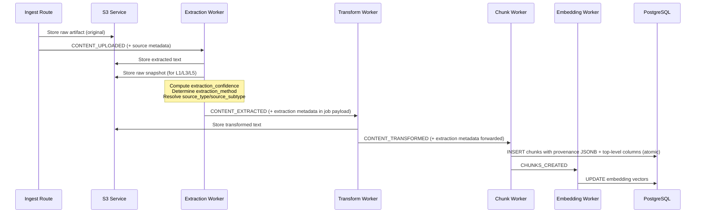
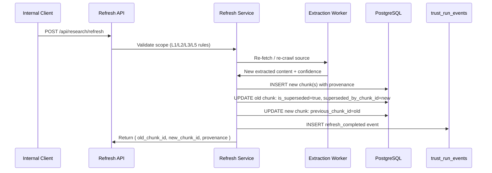
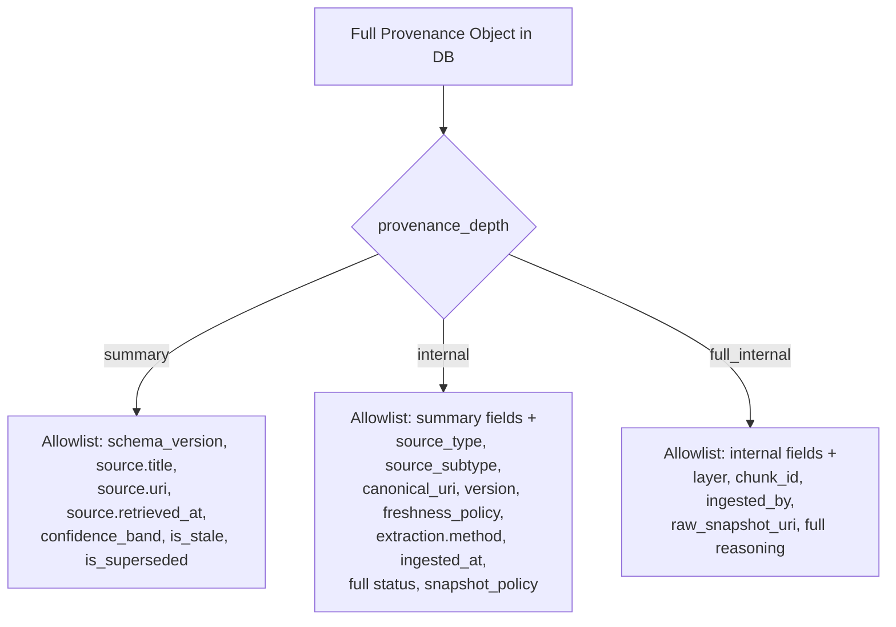

# Design Document — Provenance Engine

## Overview

The Provenance Engine extends Research360's existing ingestion pipeline and query API to attach a complete origin chain to every chunk. It introduces three concerns:

1. **Provenance at ingestion** — every chunk gets a `provenance` JSONB envelope and top-level indexed columns written atomically when the chunk is created in the `chunkWorker`.
2. **Lifecycle tracking** — independent `is_stale` and `is_superseded` states, with a refresh mechanism that creates new chunks and links them to old ones via bidirectional 1:1 supersession.
3. **Depth-controlled response shaping** — product API responses are built from per-depth allowlists (`summary`, `internal`, `full_internal`), never by stripping from the full internal object.

The engine also introduces `trust_runs` (append-only decision records) and `trust_run_events` (lifecycle events) tables for Trust360 integration.

### Integration Points

The provenance engine touches these existing modules:

| Module | Change |
|--------|--------|
| `api/src/db/migrations/` | New provenance engine migration (number determined at build time from latest existing migration) |
| `api/src/routes/ingest.js` | Already returns `job_id` from BullMQ `enqueue()` — discovery agent write-back should use `response.job_id` (not `response.document_id`) for the `ingest_job_id` column |
| `api/src/db/queries/chunks.js` | Extended `insertBatch` to write provenance columns; new queries for stale detection, supersession, provenance lookup |
| `api/src/workers/chunkWorker.js` | Passes provenance metadata through from extraction/transform stages |
| `api/src/workers/extractionWorker.js` | Emits extraction confidence and method in job payload |
| `api/src/workers/transformWorker.js` | Forwards `provenance_meta` from extraction job payload through to chunk worker |
| `api/src/services/retrievalService.js` | Returns provenance columns; filters by layer; shapes response by depth |
| `api/src/routes/query.js` | Accepts `provenance_depth`, `layers`, `run_id` parameters |
| `api/src/routes/` | New route files: `research.js` (refresh), `provenance.js` (lookup), `trust.js` (runs/events) |
| `api/src/services/` | New: `provenanceService.js` (object construction, allowlist shaping, confidence bands, stale detection) |
| `api/src/services/` | New: `refreshService.js` (re-fetch, supersession linkage) |
| `api/src/db/queries/` | New: `trustRuns.js`, `trustRunEvents.js` |
| `frontend/src/components/chat/SourceCard.jsx` | Proof360 surface: confidence band, stale warning, superseded notice |

## Architecture

### Pipeline Flow with Provenance



### Provenance Metadata Flow Through Pipeline

Extraction metadata is computed in the `extractionWorker` and forwarded through the BullMQ job payloads to the `chunkWorker`, which is the single point of truth for writing provenance to the database. This avoids multiple writes and ensures atomicity.

The job payload is extended with a `provenance_meta` object:

```json
{
  "document_id": "uuid",
  "tenant_id": "ethikslabs",
  "provenance_meta": {
    "source_type": "file",
    "source_subtype": "pdf",
    "layer": "L1",
    "extraction_confidence": 0.95,
    "extraction_method": "unstructured_io",
    "ingested_by": "ingestion-bot-v1",
    "source_uri": "https://...",
    "canonical_uri": "https://...",
    "raw_snapshot_uri": "s3://research360/ethikslabs/doc-uuid/snapshot",
    "snapshot_policy": "static",
    "freshness_policy": { "ttl_hours": null, "stale_if_fetch_fails": false },
    "source_title": "SOC 2 Type II",
    "source_version": null,
    "source_retrieved_at": "2026-03-14T09:41:22Z"
  }
}
```

### Refresh Flow

> **v1 constraint — chunk-level supersession only**: The current refresh mechanism operates at the chunk level (`superseded_by_chunk_id` / `previous_chunk_id`). This is a known v1 limitation. When a source produces a different number of chunks on refresh (fan-out or fan-in), only the first chunk is linked. A source-level lineage table (e.g., `source_snapshots` or `artifact_versions` keyed by `canonical_uri` + `version`) will be introduced in v2 to track source-level refresh history independently of chunk-level supersession. This is explicitly called out in the brief as a planned v2 enhancement.



### Response Shaping Architecture



## Components and Interfaces

### New Services

#### `provenanceService.js`

Responsible for provenance object construction, response shaping, and confidence band mapping.

```javascript
// Build the canonical provenance JSONB object at ingestion time.
// This is the SINGLE codepath that produces both the JSONB envelope
// and the top-level indexed column values. Called in chunkWorker only.
// Indexed columns are GENERATED from this canonical object — never
// written independently. This prevents drift by construction.
export function buildProvenanceObject(meta) → ProvenanceObject

// Shape provenance for API response based on depth
export function shapeByDepth(provenance, depth) → ShapedProvenance

// Map extraction confidence to display band
export function mapConfidenceBand(confidence) → 'Strong' | 'Moderate' | 'Check original'

// Validate source taxonomy
export function validateSourceTaxonomy(sourceType, sourceSubtype) → { valid, error? }
```

> **Note**: `formatDisplayTimestamp()` is NOT in this service. It lives in the frontend only. The API returns all timestamps as UTC ISO 8601 strings. See Timestamp Convention in Data Models.

#### `refreshService.js`

Handles the refresh lifecycle: re-fetch, re-extract, supersession linkage, event recording.

```javascript
// Refresh chunks by various selectors
export async function refreshChunks({ chunkIds, sourceUris, canonicalUris, reason, companyId }) → RefreshResult[]

// Check and update stale status for chunks with TTL
export async function runStaleDetection() → { updated: number }
```

#### `staleCronService.js`

A lightweight periodic check (run via BullMQ repeatable job) that marks chunks as stale when `NOW() > source_retrieved_at + ttl_hours`.

### Modified Services

#### `extractionService.js` — Changes

The `extract()` function returns an enriched result object instead of raw text:

```javascript
// Current: returns string
// New: returns { text, extraction_confidence, extraction_method }
export async function extract(document) → ExtractionResult
```

Confidence derivation per source type:
- **file (pdf/docx)**: Unstructured.io signals — OCR error rate, table fidelity. Normalised 0–1.
- **web (html)**: Playwright — JS render success, content-to-boilerplate ratio. Normalised 0–1.
- **api (json_api/xml_api)**: Schema completeness — ratio of expected fields present and non-null.
- **audio (podcast/youtube)**: Whisper per-segment confidence averaged across chunk.

#### `chunkService.js` — No Changes

The chunking logic itself doesn't change. Provenance metadata is attached in the `chunkWorker` when calling `insertBatch`, not in the chunking algorithm.

#### `retrievalService.js` — Changes

The retrieval SQL is extended to:
1. Join provenance columns from chunks
2. Accept `layers` filter parameter
3. Return raw provenance JSONB for downstream shaping

### New Database Queries

#### `trustRuns.js`

```javascript
export async function insertRun(run) → TrustRun
export async function findRunById(runId) → TrustRun | null
export async function findRunProvenance(runId) → ProvenanceData
```

#### `trustRunEvents.js`

```javascript
export async function insertEvent(event) → TrustRunEvent
export async function findEventsByRunId(runId) → TrustRunEvent[]
```

#### `chunks.js` — Extended

```javascript
// Extended insertBatch with provenance columns
export async function insertBatch(chunks) → void

// New: find provenance by chunk ID
export async function findProvenanceByChunkId(chunkId) → ProvenanceObject | null

// New: mark chunks as stale
export async function markStale(chunkIds, staleSince) → void

// New: mark chunk as superseded
export async function markSuperseded(oldChunkId, newChunkId) → void

// New: find stale-eligible chunks (TTL expired)
export async function findStaleEligible() → Chunk[]
```

### New Routes

#### `api/src/routes/research.js`

```
POST /api/research/refresh
  body: { chunk_ids?, source_uris?, canonical_uris?, reason, company_id? }
  returns: { refreshed: [{ old_chunk_id, new_chunk_id, provenance }] }
```

#### `api/src/routes/provenance.js`

```
GET /api/research/provenance/:chunk_id
  returns: { chunk_id, provenance }
```

#### `api/src/routes/trust.js`

```
GET /api/trust/runs/:run_id/provenance
  returns: { run_id, provenance_data }

GET /api/trust/runs/:run_id/events
  returns: { run_id, events: [...] }
```

### Modified Routes

#### `api/src/routes/query.js` — Changes

The existing `/research360/query` endpoint is extended to accept:
- `provenance_depth`: `'summary' | 'internal' | 'full_internal'` (default: `'summary'`)
- `layers`: `string[]` (optional filter)
- `run_id`: `uuid` (optional, read-only replay scope)

Response shape changes: each source in the `sources` array includes a `provenance` object shaped by the requested depth.

### Frontend Component

#### `SourceCard.jsx` — Changes

The existing `SourceCard` component is extended to render provenance-derived information:
- Confidence band label (Strong / Moderate / Check original)
- Retrieved date in Australia/Sydney format ("sourced 20 Mar 2026")
- Stale warning badge when `status.is_stale === true`
- Superseded notice with "refresh available" CTA when `status.is_superseded === true`

## Data Models

### Migration: Provenance Engine

Follows the existing migration pattern (sequential numbering, `IF NOT EXISTS` guards, idempotent `DO` blocks). The migration file number should be determined at build time based on the latest existing migration file in `api/src/db/migrations/`. As of this writing, `004_discovery_agent.sql` is the latest, so the next would be `005`, but this should be verified before creating the file.

#### Chunks Table Alterations

```sql
-- Provenance JSONB envelope
DO $$ BEGIN ALTER TABLE chunks ADD COLUMN provenance JSONB NOT NULL DEFAULT '{}';
EXCEPTION WHEN duplicate_column THEN NULL; END $$;

-- Top-level indexed columns for filtering and freshness
DO $$ BEGIN ALTER TABLE chunks ADD COLUMN source_type VARCHAR(20);
EXCEPTION WHEN duplicate_column THEN NULL; END $$;
DO $$ BEGIN ALTER TABLE chunks ADD COLUMN source_subtype VARCHAR(30);
EXCEPTION WHEN duplicate_column THEN NULL; END $$;
DO $$ BEGIN ALTER TABLE chunks ADD COLUMN extraction_confidence FLOAT;
EXCEPTION WHEN duplicate_column THEN NULL; END $$;
DO $$ BEGIN ALTER TABLE chunks ADD COLUMN ingested_by VARCHAR(100);
EXCEPTION WHEN duplicate_column THEN NULL; END $$;
DO $$ BEGIN ALTER TABLE chunks ADD COLUMN source_retrieved_at TIMESTAMPTZ;
EXCEPTION WHEN duplicate_column THEN NULL; END $$;
DO $$ BEGIN ALTER TABLE chunks ADD COLUMN source_uri TEXT;
EXCEPTION WHEN duplicate_column THEN NULL; END $$;
DO $$ BEGIN ALTER TABLE chunks ADD COLUMN raw_snapshot_uri TEXT;
EXCEPTION WHEN duplicate_column THEN NULL; END $$;
DO $$ BEGIN ALTER TABLE chunks ADD COLUMN snapshot_policy VARCHAR(30) DEFAULT 'static';
EXCEPTION WHEN duplicate_column THEN NULL; END $$;
DO $$ BEGIN ALTER TABLE chunks ADD COLUMN is_stale BOOLEAN DEFAULT FALSE;
EXCEPTION WHEN duplicate_column THEN NULL; END $$;
DO $$ BEGIN ALTER TABLE chunks ADD COLUMN stale_since TIMESTAMPTZ;
EXCEPTION WHEN duplicate_column THEN NULL; END $$;
DO $$ BEGIN ALTER TABLE chunks ADD COLUMN is_superseded BOOLEAN DEFAULT FALSE;
EXCEPTION WHEN duplicate_column THEN NULL; END $$;
DO $$ BEGIN ALTER TABLE chunks ADD COLUMN superseded_at TIMESTAMPTZ;
EXCEPTION WHEN duplicate_column THEN NULL; END $$;
DO $$ BEGIN ALTER TABLE chunks ADD COLUMN superseded_by_chunk_id UUID REFERENCES chunks(id);
EXCEPTION WHEN duplicate_column THEN NULL; END $$;
DO $$ BEGIN ALTER TABLE chunks ADD COLUMN previous_chunk_id UUID REFERENCES chunks(id);
EXCEPTION WHEN duplicate_column THEN NULL; END $$;
```

**`canonical_url` vs `canonical_uri` convention**: The SQL column `canonical_url` already exists from `004_discovery_agent.sql` and is used by the discovery agent. For backward compatibility, the column name stays as `canonical_url`. However, all provenance service code, JSONB fields, and API responses use `canonical_uri` consistently. The mapping is:
- SQL column: `chunks.canonical_url` (unchanged, backward compat with discovery agent)
- JSONB field: `provenance.source.canonical_uri`
- Service code: all functions in `provenanceService.js`, `refreshService.js`, etc. use `canonical_uri` as the field name
- Queries alias the column: `SELECT canonical_url AS canonical_uri` where needed

#### Indexes

```sql
CREATE INDEX IF NOT EXISTS idx_chunks_is_stale ON chunks(is_stale);
CREATE INDEX IF NOT EXISTS idx_chunks_is_superseded ON chunks(is_superseded);
CREATE INDEX IF NOT EXISTS idx_chunks_source_retrieved_at ON chunks(source_retrieved_at);
CREATE INDEX IF NOT EXISTS idx_chunks_superseded_by ON chunks(superseded_by_chunk_id);
CREATE INDEX IF NOT EXISTS idx_chunks_snapshot_policy ON chunks(snapshot_policy);
```

Note: `idx_chunks_canonical_url` already exists from migration 004.

#### Trust Runs Table

```sql
CREATE TABLE IF NOT EXISTS trust_runs (
  run_id              UUID PRIMARY KEY DEFAULT gen_random_uuid(),
  company_id          VARCHAR(100),
  run_at              TIMESTAMPTZ DEFAULT NOW(),
  corpus_snapshot     JSONB,
  chunks_retrieved    JSONB,
  reasoning_steps     JSONB,
  gaps_identified     JSONB,
  vendor_resolutions  JSONB,
  trust_scores        JSONB
);
```

Append-only. v1 enforces immutability at the application layer: no UPDATE or DELETE routes, no update/delete query functions in `trustRuns.js`. The API rejects mutation attempts with 405 Method Not Allowed.

> **v2 recommendation**: Add a PostgreSQL trigger to enforce append-only at the DB level for defense-in-depth:
> ```sql
> CREATE OR REPLACE FUNCTION prevent_trust_runs_mutation() RETURNS TRIGGER AS $$
> BEGIN RAISE EXCEPTION 'trust_runs is append-only'; END;
> $$ LANGUAGE plpgsql;
> CREATE TRIGGER trust_runs_no_update BEFORE UPDATE OR DELETE ON trust_runs
>   FOR EACH ROW EXECUTE FUNCTION prevent_trust_runs_mutation();
> ```
> This is deferred to v2 to avoid adding trigger complexity before the table is in active use.

#### Trust Run Events Table

```sql
CREATE TABLE IF NOT EXISTS trust_run_events (
  event_id    UUID PRIMARY KEY DEFAULT gen_random_uuid(),
  run_id      UUID NOT NULL REFERENCES trust_runs(run_id),
  event_type  VARCHAR(50) NOT NULL,
  event_at    TIMESTAMPTZ DEFAULT NOW(),
  payload     JSONB
);

CREATE INDEX IF NOT EXISTS idx_trust_run_events_run_id ON trust_run_events(run_id);
CREATE INDEX IF NOT EXISTS idx_trust_run_events_type ON trust_run_events(event_type);
```

Event types (v1): `stale_flagged`, `refresh_triggered`, `refresh_completed`, `dispute_opened`, `dispute_closed`.

### Provenance Object Schema (v1.0)

The canonical JSONB structure stored in `chunks.provenance`:

```json
{
  "schema_version": "1.0",
  "source_type": "file",
  "source_subtype": "pdf",
  "layer": "L1",
  "snapshot_policy": "static",
  "extraction": {
    "confidence": 0.97,
    "method": "unstructured_io",
    "ingested_at": "2026-03-14T09:43:00Z",
    "ingested_by": "ingestion-bot-v1"
  },
  "source": {
    "uri": "https://...",
    "canonical_uri": "https://...",
    "raw_snapshot_uri": "s3://bucket/snapshots/...",
    "title": "SOC 2 Type II",
    "retrieved_at": "2026-03-14T09:41:22Z",
    "version": null,
    "freshness_policy": {
      "ttl_hours": null,
      "stale_if_fetch_fails": false
    }
  },
  "status": {
    "is_stale": false,
    "stale_since": null,
    "is_superseded": false,
    "superseded_at": null,
    "superseded_by_chunk_id": null
  },
  "reasoning": {
    "run_id": null,
    "usages": []
  }
}
```

> **v2 scaling note — `reasoning.usages` in JSONB**: Storing reasoning usages inside `chunks.provenance` JSONB is correct for v1 per the brief, but will become expensive as usage count grows (each Trust360 run appends entries, and popular chunks may accumulate hundreds of usages). In v2, consider extracting usages to a dedicated `chunk_reasoning_usages` table keyed by `(chunk_id, run_id)` with columns for `step`, `step_index`, `confidence`, and `used_at`. This avoids unbounded JSONB growth and enables efficient per-run queries without full JSONB parsing.

### Source Taxonomy Enums

**`source_type`** (fixed, validated at ingestion):

| Value | Description |
|-------|-------------|
| `file` | Uploaded document (PDF, DOCX) |
| `web` | Web crawl (HTML, RSS) |
| `api` | External API response (JSON, XML) |
| `audio` | Audio/video transcript (podcast, YouTube) |

**`source_subtype`** (initial enum, extensible by migration only):

| Value | Parent source_type | Description |
|-------|-------------------|-------------|
| `pdf` | file | PDF document |
| `docx` | file | Word document |
| `html` | web | Web page |
| `rss` | web | RSS/Atom feed |
| `json_api` | api | JSON REST API response |
| `xml_api` | api | XML API response |
| `podcast` | audio | Podcast audio episode |
| `youtube` | audio | YouTube video transcript |

### Mapping from Existing `documents.source_type` to Provenance Taxonomy

The existing `documents` table uses `source_type` values: `document`, `url`, `youtube`. These map to the provenance taxonomy as follows:

| `documents.source_type` | `documents.file_type` | Provenance `source_type` | Provenance `source_subtype` | Notes |
|--------------------------|----------------------|--------------------------|----------------------------|-------|
| `document` | `pdf` | `file` | `pdf` | |
| `document` | `docx` | `file` | `docx` | |
| `document` | `pptx` | — | — | See note below |
| `url` | — | `web` | `html` | |
| `youtube` | — | `audio` | `youtube` | |

**pptx handling**: `pptx` is not in the initial `source_subtype` enum. In v1, PPTX files are accepted by the ingest route (the `ALLOWED_TYPES` array includes `pptx`) but extraction requires Unstructured.io to convert them to text. The provenance subtype `pptx` does not exist yet. Options: (a) extract text via Unstructured.io and store as `file/pdf` with a `metadata.converted_from: 'pptx'` note in the provenance JSONB, or (b) reject PPTX at the provenance layer until a `pptx` subtype is added via migration. The recommended v1 approach is (a) — store as `file/pdf` with the conversion note — since Unstructured.io already handles PPTX extraction and the ingest route already accepts it. A future migration can add `pptx` as a proper subtype.

### Layer Assignment Mapping

The provenance engine introduces evidence layers (L1–L5) but the existing codebase has no layer concept. The layer is determined at ingestion time based on the source context. The `extractionWorker` computes the layer as part of `provenance_meta` using this explicit mapping:

| Source Context | `documents.source_type` | `discovery_candidates.source_tier` | Provenance Layer | Rationale |
|---------------|------------------------|-----------------------------------|-----------------|-----------|
| Uploaded file (PDF, DOCX) | `document` | — | **L1** | Core corpus, manually uploaded files |
| Customer-scoped upload | `document` (with `company_id`/`session_id` scope) | — | **L2** | Customer corpus, private to company |
| Real-time web crawl / RSS | `url` (via discovery agent) | `source_tier: 3` | **L3** | Web crawls, RSS feeds |
| Discovery agent tier 1 | `url` (via discovery agent) | `source_tier: 1` | **L1** | Authoritative framework/gov sources |
| Discovery agent tier 2 | `url` (via discovery agent) | `source_tier: 2` | **L2** | Vendor-specific sources scoped to company context |
| Structured JSON API | — (via API integration) | — | **L5** | External API responses (Ingram, Vanta, GitHub) |
| YouTube / podcast | `youtube` | — | **L1** | Uploaded media, treated as core corpus |

**Resolution logic in `extractionWorker`**:
1. If the document has a `discovery_candidate_id`, look up the candidate's `source_tier`: tier 1 → L1, tier 2 → L2, tier 3 → L3.
2. If the document has `company_id` or `session_id` scope → L2.
3. If `source_type` is `api` → L5.
4. Otherwise (direct upload: `document`, `youtube`) → L1.

This mapping is performed in the `extractionWorker` when computing `provenance_meta`.

### Confidence Band Mapping

Deterministic, applied identically by all consumers:

| `extraction.confidence` | Display Band |
|--------------------------|-------------|
| ≥ 0.90 | `"Strong"` |
| ≥ 0.70 and < 0.90 | `"Moderate"` |
| < 0.70 | `"Check original"` |

### Timestamp Convention

- All `TIMESTAMPTZ` columns and JSONB timestamp fields store UTC.
- Never store AEST/AEDT offsets.
- All API responses return timestamps as UTC ISO 8601 strings (e.g., `"2026-03-14T09:41:22Z"`). The API never renders `Australia/Sydney`.
- `formatDisplayTimestamp()` lives in the frontend only (`frontend/src/` utilities), not in `provenanceService.js` or any API service. The API boundary is strictly UTC.
- Display format: `"sourced 20 Mar 2026"` using `Intl.DateTimeFormat` with `timeZone: 'Australia/Sydney'` — frontend-only.


## Correctness Properties

*A property is a characteristic or behavior that should hold true across all valid executions of a system — essentially, a formal statement about what the system should do. Properties serve as the bridge between human-readable specifications and machine-verifiable correctness guarantees.*

### Property 1: Provenance object construction validity

*For any* valid ingestion metadata (source type, subtype, layer, extraction signals), `buildProvenanceObject` SHALL produce a provenance object where: `schema_version` equals `"1.0"`, `extraction.confidence` is in `[0, 1]`, `reasoning` equals `{ run_id: null, usages: [] }` (usages is an array, never null), and `status` equals `{ is_stale: false, stale_since: null, is_superseded: false, superseded_at: null, superseded_by_chunk_id: null }`.

**Validates: Requirements 2.1, 2.5, 2.7, 2.8, 8.1**

### Property 2: Source taxonomy validation

*For any* string pair `(source_type, source_subtype)`, `validateSourceTaxonomy` SHALL return `valid: true` if and only if `source_type` is in `{file, web, api, audio}` AND `source_subtype` is in `{pdf, docx, html, rss, json_api, xml_api, podcast, youtube}`. For all other string pairs, it SHALL return `valid: false` with an error message.

**Validates: Requirements 2.3, 2.4, 2.6, 3.1, 3.2, 3.3**

### Property 3: Provenance column/JSONB consistency at write (drift prevention)

*For any* provenance object written via `insertBatch`, the top-level indexed columns (`source_type`, `source_subtype`, `extraction_confidence`, `snapshot_policy`, `is_stale`, `is_superseded`) SHALL equal the corresponding values inside the `provenance` JSONB envelope on the same row. This is enforced by construction: `buildProvenanceObject` produces the canonical JSONB, and `chunkWorker` extracts indexed column values from that same object in a single write. There is no separate codepath that writes indexed columns independently.

**Validates: Requirements 2.2, 4.1, 7.1**

> **v2 consideration**: Add DB-level `GENERATED ALWAYS AS` expressions or CHECK constraints to enforce column/JSONB consistency at the database level, providing defense-in-depth beyond the application-layer single-codepath guarantee.

### Property 4: Layer-to-policy mapping

*For any* evidence layer, `buildProvenanceObject` SHALL set `snapshot_policy` and `freshness_policy` according to the layer rules: L1 → `{static, {ttl_hours: null, stale_if_fetch_fails: false}}`; L2 → `{refresh_on_request, ...}`; L3 → `{auto_refresh, {stale_if_fetch_fails: true}}`; L5 → `{auto_refresh, {stale_if_fetch_fails: true}}`.

**Validates: Requirements 4.2, 4.3, 4.4, 4.5**

### Property 5: Stale and superseded independence

*For any* chunk, setting `is_stale` SHALL not modify `is_superseded`, and setting `is_superseded` SHALL not modify `is_stale`. All four combinations (neither, stale-only, superseded-only, both) SHALL be representable.

**Validates: Requirements 5.1, 5.5, 5.6**

### Property 6: TTL-based stale detection

*For any* chunk with `freshness_policy.ttl_hours` set to a non-null positive number, the stale detector SHALL set `is_stale = true` if and only if `NOW() > source_retrieved_at + ttl_hours`. *For any* chunk with `freshness_policy.ttl_hours = null`, the stale detector SHALL leave `is_stale` unchanged by the time-based rule.

**Validates: Requirements 5.2, 5.3**

### Property 7: Fetch-failure stale detection

*For any* chunk with `freshness_policy.stale_if_fetch_fails = true`, when a fetch or crawl fails (non-200 or timeout), the stale detector SHALL set `is_stale = true` regardless of TTL state.

**Validates: Requirements 5.4**

### Property 8: Supersession bidirectional linkage

*For any* refresh that produces a new chunk replacing an old chunk, `old.superseded_by_chunk_id` SHALL equal `new.id` AND `new.previous_chunk_id` SHALL equal `old.id`. This forms a bidirectional 1:1 linkage.

**Validates: Requirements 6.1, 6.2, 6.3, 13.5**

### Property 9: Indexed columns derived from JSONB

*For any* provenance object produced by `buildProvenanceObject`, the top-level indexed column values (`source_type`, `source_subtype`, `extraction_confidence`, `snapshot_policy`, `is_stale`, `is_superseded`) SHALL be extracted from the canonical JSONB object in the same codepath. There is no independent write path for indexed columns. On read, if divergence is detected (e.g., due to a manual DB edit), the API response SHALL use the value from the `provenance` JSONB and log the divergence.

**Validates: Requirements 7.2**

### Property 10: Reasoning usage accumulation

*For any* sequence of N reasoning usage appends to a chunk's provenance, the `reasoning.usages` array SHALL have length N, each entry SHALL contain `step` (string), `step_index` (integer), `confidence` (float in [0,1]), and `used_at` (ISO 8601 UTC timestamp), and no prior entries SHALL be overwritten or collapsed.

**Validates: Requirements 8.2, 8.3**

### Property 11: Run-scoped reasoning in query responses

*For any* query request, if `run_id` is provided, the `reasoning` block in the response SHALL contain only usages from that specific run. If `run_id` is not provided, the `reasoning` block SHALL be `{ run_id: null, usages: [] }`.

**Validates: Requirements 8.4, 8.5, 12.2**

### Property 12: Depth-based response shaping

*For any* full provenance object and any `provenance_depth` in `{summary, internal, full_internal}`, `shapeByDepth` SHALL return an object containing exactly the allowlisted fields for that depth and no others. Specifically: `summary` SHALL NOT contain `layer`, `chunk_id`, `extraction.ingested_by`, `raw_snapshot_uri`, or `reasoning`; `internal` SHALL NOT contain `layer`, `chunk_id`, `extraction.ingested_by`, `raw_snapshot_uri`, or `reasoning`; `full_internal` SHALL contain all fields.

**Validates: Requirements 9.1, 9.2, 9.3, 9.5, 12.1**

### Property 13: Confidence band mapping

*For any* float value `c` in `[0, 1]`, `mapConfidenceBand(c)` SHALL return `"Strong"` if `c >= 0.90`, `"Moderate"` if `0.70 <= c < 0.90`, and `"Check original"` if `c < 0.70`.

**Validates: Requirements 10.1, 10.2, 10.3**

### Property 14: Layer filtering in queries

*For any* query with a `layers` filter array, all returned chunks SHALL have a `layer` value that is a member of the specified `layers` array.

**Validates: Requirements 12.4**

### Property 15: Refresh scope enforcement per layer

*For any* refresh request targeting L3 or L5 chunks, the refresh SHALL require `source_uri` or `canonical_uri`. *For any* refresh request targeting L1 chunks, the refresh SHALL require a raw S3 snapshot or explicit file submission. *For any* refresh request targeting L2 chunks, the refresh SHALL require `company_id`.

**Validates: Requirements 13.2, 13.3, 13.4**

### Property 16: Refresh event recording

*For any* completed refresh operation, a `refresh_completed` event SHALL exist in `trust_run_events` with a payload referencing the old and new chunk IDs.

**Validates: Requirements 13.6**

### Property 17: Trust run events ordering

*For any* trust run with events, `GET /api/trust/runs/:run_id/events` SHALL return events ordered by `event_at` ascending.

**Validates: Requirements 14.3**

### Property 18: Timestamp formatting (frontend-only)

*For any* UTC timestamp, the frontend `formatDisplayTimestamp` utility SHALL return a string formatted in `Australia/Sydney` timezone as human-readable text (e.g., "sourced 20 Mar 2026"). The output SHALL never contain raw UTC or AEST/AEDT offset strings. The input SHALL always be a valid ISO 8601 UTC timestamp. The API SHALL return all timestamps as UTC ISO 8601 strings and SHALL NOT perform any timezone conversion.

**Validates: Requirements 15.4, 16.2, 16.3, 16.4**

### Property 19: Stale and superseded rendering

*For any* source with `status.is_stale === true`, the rendered source card SHALL contain a stale warning indicator. *For any* source with `status.is_superseded === true`, the rendered source card SHALL contain a superseded notice with a refresh CTA.

**Validates: Requirements 15.2, 15.3**

### Property 20: Source card required fields

*For any* provenance-bearing source, the rendered source card SHALL contain: source title, retrieved date in Australia/Sydney format, confidence band label, and source URI as a link.

**Validates: Requirements 15.1**

### Property 21: L1/L3/L5 raw snapshot URI presence

*For any* chunk created for an L1, L3, or L5 source, `provenance.source.raw_snapshot_uri` SHALL be a non-null, non-empty string pointing to an S3 key.

**Validates: Requirements 2.9**

## Error Handling

### Ingestion Errors

| Error Condition | Handling |
|----------------|----------|
| Invalid `source_type` or `source_subtype` | Reject with 400 and validation error message. Chunk is not created. |
| Extraction confidence computation fails | Default to `0.5` (Moderate band) and log warning. Do not block ingestion. |
| S3 snapshot upload fails for L1/L3/L5 | Retry 3x with exponential backoff. On final failure, set `raw_snapshot_uri` to null and log error. Chunk is still created. |
| Provenance JSONB construction fails | Pipeline stage fails. Document status set to `FAILED` with `failed_stage: 'chunking'`. Standard retry via BullMQ. |

### Query Errors

| Error Condition | Handling |
|----------------|----------|
| Invalid `provenance_depth` value | Default to `'summary'`. Log warning. |
| Invalid `run_id` (not found) | Return 404 with `{ error: 'Trust run not found', code: 'RUN_NOT_FOUND' }` |
| Invalid `chunk_id` (not found) | Return 404 with `{ error: 'Chunk not found', code: 'CHUNK_NOT_FOUND' }` |
| JSONB/column divergence detected | Use JSONB as authoritative. Log divergence for monitoring. This should not occur in normal operation since indexed columns are derived from the JSONB in a single codepath (`buildProvenanceObject` → `chunkWorker` write). Divergence indicates a manual DB edit or bug. |

### Refresh Errors

| Error Condition | Handling |
|----------------|----------|
| L1 refresh without snapshot or file | Return 400 with `{ error: 'L1 refresh requires existing snapshot or new file', code: 'L1_NO_SNAPSHOT' }` |
| L2 refresh without `company_id` | Return 400 with `{ error: 'L2 refresh requires company_id', code: 'L2_NO_COMPANY' }` |
| L3/L5 refresh without URI | Return 400 with `{ error: 'L3/L5 refresh requires source_uri or canonical_uri', code: 'URI_REQUIRED' }` |
| Re-fetch fails (non-200 / timeout) | If `stale_if_fetch_fails`, mark chunk as stale. Return partial result with error detail. Write `refresh_triggered` event but not `refresh_completed`. |
| Fan-out (multiple replacement chunks) | Link only first chunk. Log v1 constraint warning. Document in response. |

### Stale Detection Errors

| Error Condition | Handling |
|----------------|----------|
| Stale cron job fails | Log error. Next scheduled run will retry. No data corruption risk (stale detection is idempotent). |
| `source_retrieved_at` is null | Skip chunk in stale detection. Log warning. |

### Trust Run Errors

| Error Condition | Handling |
|----------------|----------|
| Attempt to UPDATE/DELETE trust_runs | API rejects with 405 Method Not Allowed. v1 enforces at the application layer (no UPDATE/DELETE routes or query functions). v2 recommendation: add a DB trigger for defense-in-depth (see Trust Runs Table section). |
| Invalid event_type | Reject with 400. Only accept defined v1 event types. |

## Testing Strategy

### Unit Tests

Unit tests cover specific examples, edge cases, and integration points. Located in `api/tests/unit/`.

Key unit test areas:
- Migration verification (schema, columns, indexes, table existence)
- Provenance object construction with specific known inputs
- Confidence band boundary values (exactly 0.70, exactly 0.90)
- Timestamp formatting with known dates across DST boundaries
- Allowlist shaping with a known full provenance object at each depth
- 404 responses for missing chunk_id and run_id
- Trust run immutability (INSERT succeeds, UPDATE/DELETE rejected)
- Refresh scope validation error cases
- L2 source with no file → null raw_snapshot_uri
- Fan-out refresh → only first chunk linked (v1 constraint)

### Property-Based Tests

Property tests verify universal properties across randomized inputs. Located in `api/tests/property/`. Uses `fast-check` (already in devDependencies).

Each property test:
- Runs minimum 100 iterations
- References its design document property via comment tag
- Uses `fast-check` arbitraries to generate random provenance metadata, confidence values, timestamps, source types, etc.

Property test files:

| File | Properties Covered |
|------|-------------------|
| `provenance-construction.prop.test.js` | P1 (object validity), P2 (taxonomy validation), P3 (column/JSONB consistency), P4 (layer-to-policy), P21 (L1/L3/L5 snapshot URI) |
| `stale-superseded.prop.test.js` | P5 (independence), P6 (TTL stale detection), P7 (fetch-failure stale) |
| `supersession-linkage.prop.test.js` | P8 (bidirectional linkage) |
| `response-shaping.prop.test.js` | P9 (indexed columns derived from JSONB), P12 (depth shaping), P13 (confidence bands) |
| `reasoning-usage.prop.test.js` | P10 (usage accumulation), P11 (run-scoped reasoning) |
| `refresh-scope.prop.test.js` | P15 (scope enforcement per layer) |
| `timestamp-formatting.prop.test.js` | P18 (timestamp formatting — frontend utility) |

Tag format for each test: `Feature: provenance-engine, Property {N}: {title}`

Example:
```javascript
// Feature: provenance-engine, Property 13: Confidence band mapping
test.prop('confidence band mapping is deterministic', [fc.double({ min: 0, max: 1, noNaN: true })], (confidence) => {
  const band = mapConfidenceBand(confidence);
  if (confidence >= 0.90) expect(band).toBe('Strong');
  else if (confidence >= 0.70) expect(band).toBe('Moderate');
  else expect(band).toBe('Check original');
});
```

### Frontend Tests

Properties P19 (stale/superseded rendering) and P20 (source card fields) are tested via React component tests using `@testing-library/react` with `fast-check` for generating random provenance objects. These live in `frontend/src/components/chat/__tests__/`.

### Test Configuration

The existing `api/vitest.config.js` already includes `tests/**/*.prop.test.js` in its test patterns, so property tests will be picked up automatically.

```javascript
// vitest.config.js (existing — no changes needed)
export default defineConfig({
  test: {
    include: ['tests/**/*.test.js', 'tests/**/*.prop.test.js'],
    testTimeout: 30000,
  },
});
```
