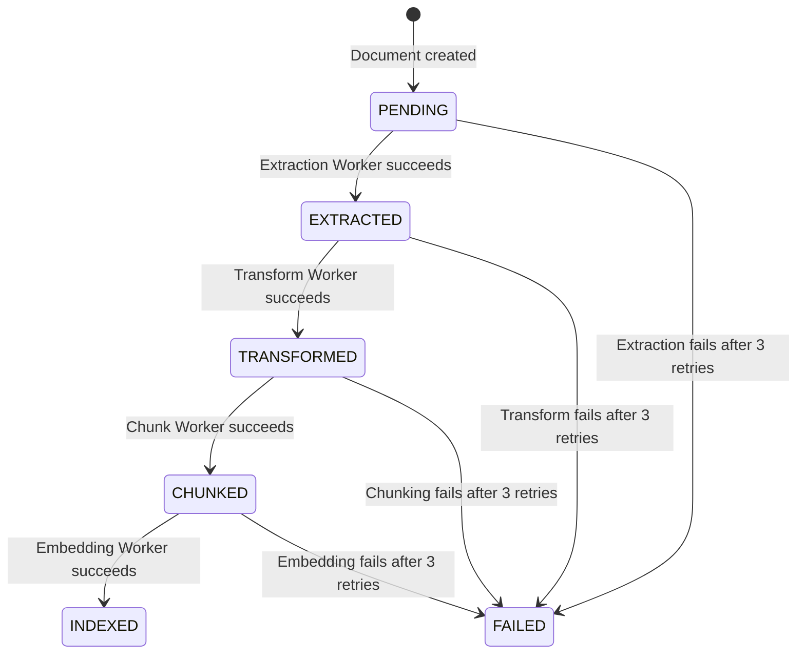

# Design Document — Research360 API

## Overview

Research360 API is the backend knowledge ingestion, retrieval, and reasoning service for the ethikslabs platform. It accepts documents (PDF, DOCX, PPTX), web URLs, and YouTube URLs, processes them through a four-stage asynchronous pipeline (extraction → transformation → chunking → embedding), stores the resulting vector embeddings in pgvector, and exposes a query endpoint that retrieves relevant chunks and runs Claude-powered reasoning with persona and complexity controls.

The system is built on Node.js 20 with Fastify as the HTTP framework, BullMQ (backed by Redis) for pipeline orchestration, Postgres+pgvector for relational and vector storage, S3 for raw artifact storage, OpenAI text-embedding-3-large for embeddings, and Anthropic Claude (claude-sonnet-4-6) for reasoning.

### Key Design Decisions

1. **Single-process deployment**: The Fastify server and all BullMQ workers run in the same Node.js process. This simplifies deployment to ECS at MVP while still allowing future separation.
2. **Tenant scoping from day one**: All queries enforce `tenant_id` filtering even though the MVP is single-tenant (`ethikslabs`). The schema is correct from the start.
3. **Fail-fast startup**: All environment variables are validated before the server starts. Missing config terminates the process immediately.
4. **Consistent error shape**: Every error response follows `{ "error": "message", "code": "ERROR_CODE" }` across all endpoints.
5. **Structured JSON logging**: All pipeline stages and API operations emit structured JSON logs for CloudWatch ingestion.
6. **Whisper fallback**: For YouTube transcription, if a local Whisper binary is unavailable, the system falls back to the OpenAI Whisper API (`openai.audio.transcriptions`).

## Architecture

### System Flow

```mermaid
graph TD
    Client[Client / Frontend] -->|HTTP| API[Fastify API]
    
    subgraph Ingestion
        API -->|POST /ingest/file| IngestFile[File Upload Handler]
        API -->|POST /ingest/url| IngestURL[URL Handler]
        IngestFile -->|Upload raw file| S3[(S3)]
        IngestFile -->|Insert document| PG[(Postgres)]
        IngestURL -->|Insert document| PG
        IngestFile -->|Enqueue CONTENT_UPLOADED| Redis[(Redis / BullMQ)]
        IngestURL -->|Enqueue CONTENT_UPLOADED| Redis
    end

    subgraph Pipeline Workers
        Redis -->|CONTENT_UPLOADED| EW[Extraction Worker]
        EW -->|Unstructured.io / Playwright / yt-dlp+Whisper| ExtSvc[Extraction Service]
        ExtSvc -->|Save extracted text| S3
        EW -->|CONTENT_EXTRACTED| Redis
        
        Redis -->|CONTENT_EXTRACTED| TW[Transform Worker]
        TW -->|Normalise text| TransSvc[Transform Service]
        TransSvc -->|Save transformed text| S3
        TW -->|CONTENT_TRANSFORMED| Redis
        
        Redis -->|CONTENT_TRANSFORMED| CW[Chunk Worker]
        CW -->|Segment text| ChunkSvc[Chunk Service]
        ChunkSvc -->|Insert chunks| PG
        CW -->|CHUNKS_CREATED| Redis
        
        Redis -->|CHUNKS_CREATED| EmW[Embedding Worker]
        EmW -->|OpenAI text-embedding-3-large| EmbSvc[Embedding Service]
        EmbSvc -->|Store vectors| PG
        EmW -->|INDEX_COMPLETE| Redis
    end

    subgraph Query Path
        API -->|POST /query| QueryHandler[Query Handler]
        QueryHandler -->|Embed query| OpenAI[OpenAI API]
        QueryHandler -->|Cosine similarity search| PG
        QueryHandler -->|Assemble prompt + call Claude| Claude[Anthropic Claude]
        QueryHandler -->|Load/save session| PG
        QueryHandler -->|Return answer, sources, suggestions| Client
    end

    subgraph Management
        API -->|GET /documents| DocList[Document List]
        API -->|GET /documents/:id| DocDetail[Document Detail]
        API -->|DELETE /documents/:id| DocDelete[Document Delete]
        API -->|GET /sessions/:id| SessionGet[Session History]
        API -->|GET /health| Health[Health Check]
        DocList --> PG
        DocDetail --> PG
        DocDelete --> PG
        DocDelete --> S3
        SessionGet --> PG
        Health --> PG
        Health --> Redis
        Health --> S3
    end
```




### Build Phases

The implementation follows a strict two-phase build order. Phase 2 must not begin until Phase 1 is confirmed working.

**Phase 1 — Foundation (build first, confirm before continuing):**

| Step | Files | Requirement |
|------|-------|-------------|
| 1 | `config/env.js` | Req 1 — Env validation, fail fast |
| 2 | `db/client.js` + `db/migrations/001_initial.sql` | Req 2 — Postgres connection, migration, tables, indexes |
| 3 | `queue/client.js` + `queue/events.js` | Req 23 — BullMQ + Redis, event constants |
| 4 | `services/s3Service.js` | Req 13 — S3 upload/download/delete |
| 5 | `routes/health.js` | Req 20 — Health check (Postgres, Redis, S3) |
| 6 | `routes/ingest.js` | Reqs 3, 4 — File upload + URL ingestion |
| 7 | `routes/documents.js` | Reqs 5, 6, 7 — List, detail, delete |

**Phase 2 — Pipeline & Query (after Phase 1 confirmed):**

| Step | Files | Requirement |
|------|-------|-------------|
| 8 | `workers/extractionWorker.js` + `services/extractionService.js` | Req 8 — Extraction |
| 9 | `workers/transformWorker.js` + `services/transformService.js` | Req 9 — Transform |
| 10 | `workers/chunkWorker.js` + `services/chunkService.js` | Req 10 — Chunking |
| 11 | `workers/embeddingWorker.js` + `services/embeddingService.js` | Req 11 — Embedding |
| 12 | `services/retrievalService.js` | Req 14 — pgvector search |
| 13 | `config/personas.js` + `services/reasoningService.js` | Reqs 15, 16, 17 — Reasoning + personas + complexity |
| 14 | `routes/query.js` + session management | Reqs 18, 19 — Query endpoint + sessions |
| 15 | `Dockerfile` + `.env.example` | Req 24 — Containerisation |

## Components and Interfaces

### Directory Structure

```
api/
├── src/
│   ├── config/
│   │   ├── env.js                 ← environment variable validation
│   │   └── personas.js            ← persona prompt definitions
│   ├── db/
│   │   ├── client.js              ← Postgres pool + migration runner
│   │   ├── migrations/
│   │   │   └── 001_initial.sql    ← schema: documents, chunks, sessions, indexes
│   │   └── queries/
│   │       ├── documents.js       ← document CRUD queries
│   │       ├── chunks.js          ← chunk insert/query
│   │       └── sessions.js        ← session CRUD queries
│   ├── queue/
│   │   ├── client.js              ← BullMQ Queue + Redis connection
│   │   └── events.js              ← queue event constants
│   ├── routes/
│   │   ├── ingest.js              ← POST /ingest/file, POST /ingest/url
│   │   ├── query.js               ← POST /query
│   │   ├── documents.js           ← GET/DELETE /documents
│   │   └── health.js              ← GET /health
│   ├── workers/
│   │   ├── extractionWorker.js    ← consumes CONTENT_UPLOADED
│   │   ├── transformWorker.js     ← consumes CONTENT_EXTRACTED
│   │   ├── chunkWorker.js         ← consumes CONTENT_TRANSFORMED
│   │   └── embeddingWorker.js     ← consumes CHUNKS_CREATED
│   ├── services/
│   │   ├── extractionService.js   ← Unstructured, Playwright, yt-dlp/Whisper
│   │   ├── transformService.js    ← text normalisation
│   │   ├── chunkService.js        ← semantic chunking with tiktoken
│   │   ├── embeddingService.js    ← OpenAI embeddings
│   │   ├── retrievalService.js    ← pgvector cosine similarity search
│   │   ├── reasoningService.js    ← Claude reasoning + persona assembly
│   │   └── s3Service.js           ← S3 upload/download/delete
│   └── app.js                     ← Fastify app setup, route registration, worker init
├── Dockerfile
├── package.json
└── .env.example
```


### Component Interfaces

#### config/env.js

```javascript
// Validates all required env vars on import. Throws and terminates if any are missing.
// Returns a frozen config object.
export function validateEnv()
// Returns: { DATABASE_URL, REDIS_URL, AWS_REGION, AWS_ACCESS_KEY_ID, AWS_SECRET_ACCESS_KEY,
//            S3_BUCKET, OPENAI_API_KEY, ANTHROPIC_API_KEY, UNSTRUCTURED_API_KEY, PORT, NODE_ENV }
```

#### config/personas.js

```javascript
// Exports persona prompt strings keyed by persona name.
export const PERSONAS = {
  strategist: '...', // high-level synthesis, executive tone
  analyst: '...'     // structured breakdown, evidence-driven
}
```

#### db/client.js

```javascript
// Creates and exports a pg Pool connected to DATABASE_URL.
// Runs migrations on first call to initialize().
export const pool // pg.Pool instance
export async function initialize() // runs 001_initial.sql, creates extensions + tables + indexes
export async function healthCheck() // SELECT 1 — returns true/false
```

#### queue/client.js

```javascript
// Creates BullMQ Queue and IORedis connection from REDIS_URL.
export const connection // IORedis instance
export const pipelineQueue // BullMQ Queue instance
export async function healthCheck() // PING — returns true/false
```

#### queue/events.js

```javascript
// Queue event constants used across all workers and routes.
export const EVENTS = {
  CONTENT_UPLOADED: 'CONTENT_UPLOADED',
  CONTENT_EXTRACTED: 'CONTENT_EXTRACTED',
  CONTENT_TRANSFORMED: 'CONTENT_TRANSFORMED',
  CHUNKS_CREATED: 'CHUNKS_CREATED',
  EMBEDDINGS_CREATED: 'EMBEDDINGS_CREATED',
  INDEX_COMPLETE: 'INDEX_COMPLETE',
  PIPELINE_FAILED: 'PIPELINE_FAILED'
}
// Every event payload includes: { document_id, tenant_id, timestamp, stage }
// PIPELINE_FAILED additionally includes: { error }
```

#### services/s3Service.js

```javascript
export async function upload(tenantId, documentId, stage, body, contentType)
export async function download(tenantId, documentId, stage) // returns Buffer
export async function deleteAll(tenantId, documentId) // deletes all objects under prefix
export async function healthCheck() // HeadBucket — returns true/false
```

#### services/extractionService.js

```javascript
// Dispatches extraction based on source_type.
export async function extract(document) // returns { text: string }
// Internally:
//   source_type 'document' → download from S3, send to Unstructured.io API
//   source_type 'url' → Playwright + Readability
//   source_type 'youtube' → yt-dlp + Whisper (fallback: OpenAI Whisper API)
```

#### services/transformService.js

```javascript
// Normalises extracted text.
export function transform(rawText) // returns { text: string, boundaries: number[] }
// Operations: strip whitespace/control chars, remove filler words, reconstruct paragraphs,
//             normalise unicode, identify semantic boundaries
```

#### services/chunkService.js

```javascript
// Segments transformed text into overlapping chunks.
export function chunk(text, boundaries) // returns Array<{ chunk_text, chunk_index, chunk_hash, token_count }>
// Config: target 700 tokens/chunk, 15% overlap, respect semantic boundaries
// Uses tiktoken for token counting, crypto.createHash('sha256') for hashing
```

#### services/embeddingService.js

```javascript
// Generates embeddings via OpenAI text-embedding-3-large.
export async function embedTexts(texts) // returns Array<number[]> (3072-dim vectors)
export async function embedText(text) // returns number[] (single 3072-dim vector)
// Batches up to 100 texts per API call. Logs latency and token usage.
```

#### services/retrievalService.js

```javascript
export async function retrieve({ query, tenantId, k, filters })
// 1. Embeds query via embeddingService.embedText()
// 2. Runs pgvector cosine similarity: 1 - (embedding <=> queryVector)
// 3. Applies tenant_id filter (always) + optional source_type/document_id filters
// 4. Returns top-k chunks with: chunk_id, chunk_text, chunk_index, metadata,
//    relevance_score, document_id, document_title, source_type, source_url
```

#### services/reasoningService.js

```javascript
export async function reason({ query, chunks, persona, complexity, history })
// 1. Looks up persona prompt from PERSONAS[persona]
// 2. Gets complexity config (k, style instruction)
// 3. Assembles system prompt: persona + style + "reason from context only" + "3 suggestions"
// 4. Builds messages: system prompt, history (last 6 turns), context chunks, user query
// 5. Calls Anthropic Claude claude-sonnet-4-6
// 6. Parses JSON response: { answer, suggestions }
// 7. Returns { answer, persona, complexity, sources, suggestions }
```

#### Workers (all follow the same pattern)

```javascript
// Each worker is a BullMQ Worker consuming a specific event.
// Retry config: attempts=3, backoff={ type:'custom', delay: [1000, 5000, 30000] }
// On success: update document status, enqueue next event
// On final failure: update document status to FAILED, store error in metadata
// All operations log structured JSON with document_id and stage
```

### Route Interfaces

| Method | Path | Request | Response |
|--------|------|---------|----------|
| POST | `/research360/ingest/file` | multipart/form-data: file, title?, tenant_id? | `{ document_id, status, message }` |
| POST | `/research360/ingest/url` | JSON: `{ url, title?, tenant_id? }` | `{ document_id, status, source_type, message }` |
| GET | `/research360/documents` | Query: status?, source_type?, limit?, offset? | `{ documents[], total }` |
| GET | `/research360/documents/:id` | — | `{ id, title, source_type, status, chunk_count, metadata, created_at }` |
| DELETE | `/research360/documents/:id` | — | 204 No Content |
| POST | `/research360/query` | JSON: `{ query, tenant_id?, persona?, complexity?, session_id?, filters? }` | `{ answer, persona, complexity, session_id, sources[], suggestions[] }` |
| GET | `/research360/sessions/:id` | — | `{ session_id, history[] }` |
| GET | `/health` | — | `{ status, postgres, redis, s3 }` |


## Data Models

### Database Schema

#### documents table

| Column | Type | Constraints | Description |
|--------|------|-------------|-------------|
| id | UUID | PK, DEFAULT gen_random_uuid() | Document identifier |
| tenant_id | TEXT | NOT NULL, DEFAULT 'ethikslabs' | Tenant scope |
| title | TEXT | nullable | Human-readable title |
| source_type | TEXT | NOT NULL | 'document', 'url', or 'youtube' |
| source_url | TEXT | nullable | Original URL for url/youtube types |
| file_name | TEXT | nullable | Original filename for uploads |
| file_type | TEXT | nullable | MIME type or extension |
| s3_key | TEXT | nullable | S3 path to original artifact |
| status | TEXT | NOT NULL, DEFAULT 'PENDING' | Pipeline status: PENDING → EXTRACTED → TRANSFORMED → CHUNKED → INDEXED / FAILED |
| metadata | JSONB | DEFAULT '{}' | Extensible metadata (error messages stored here on failure) |
| created_at | TIMESTAMPTZ | DEFAULT NOW() | Creation timestamp |
| updated_at | TIMESTAMPTZ | DEFAULT NOW() | Last update timestamp |

#### chunks table

| Column | Type | Constraints | Description |
|--------|------|-------------|-------------|
| id | UUID | PK, DEFAULT gen_random_uuid() | Chunk identifier |
| tenant_id | TEXT | NOT NULL, DEFAULT 'ethikslabs' | Tenant scope |
| document_id | UUID | FK → documents(id) ON DELETE CASCADE | Parent document |
| chunk_index | INTEGER | NOT NULL | Position within document |
| chunk_text | TEXT | NOT NULL | Chunk content |
| chunk_hash | TEXT | NOT NULL, UNIQUE INDEX | SHA-256 hash for deduplication |
| token_count | INTEGER | nullable | Token count via tiktoken |
| embedding | vector(3072) | nullable, HNSW index | OpenAI text-embedding-3-large vector |
| metadata | JSONB | DEFAULT '{}' | Extensible metadata |
| created_at | TIMESTAMPTZ | DEFAULT NOW() | Creation timestamp |

**Indexes:**
- `chunks_embedding_idx` — HNSW index on `embedding` using `vector_cosine_ops`
- `chunks_tenant_doc_idx` — Composite index on `(tenant_id, document_id)`
- `chunks_hash_idx` — Unique index on `chunk_hash`

#### sessions table

| Column | Type | Constraints | Description |
|--------|------|-------------|-------------|
| id | UUID | PK, DEFAULT gen_random_uuid() | Session identifier |
| tenant_id | TEXT | NOT NULL, DEFAULT 'ethikslabs' | Tenant scope |
| title | TEXT | nullable | Session title |
| history | JSONB | DEFAULT '[]' | Array of conversation turns |
| created_at | TIMESTAMPTZ | DEFAULT NOW() | Creation timestamp |
| updated_at | TIMESTAMPTZ | DEFAULT NOW() | Last update timestamp |

#### Session History Turn Format

```json
{
  "role": "user" | "assistant",
  "content": "message text",
  "persona": "strategist",  // assistant turns only
  "timestamp": "ISO 8601"
}
```

### S3 Artifact Structure

```
s3://{S3_BUCKET}/
  {tenant_id}/
    {document_id}/
      original       ← raw upload or downloaded file
      extracted      ← raw extracted text
      transformed    ← normalised text
      transcript     ← audio transcripts (YouTube/audio sources)
```

### Queue Event Payloads

All events carry a base payload:

```json
{
  "document_id": "uuid",
  "tenant_id": "ethikslabs",
  "timestamp": "ISO 8601",
  "stage": "extraction | transform | chunk | embedding"
}
```

`PIPELINE_FAILED` additionally includes:

```json
{
  "error": "error message string"
}
```

### Pipeline State Machine



### Complexity Mode Configuration

| Mode | Top-k Chunks | Reasoning Style |
|------|-------------|-----------------|
| `simple` | 3 | Brief, direct answer. 2-3 sentences maximum. |
| `detailed` | 10 | Structured analysis. Use sections if helpful. |
| `deep` | 20 | Comprehensive reasoning. Full evidence citation. |

Default: `detailed`

### Worker Retry Configuration

All BullMQ workers share the same retry configuration:

- **Max attempts**: 3
- **Backoff strategy**: Custom exponential — 1s, 5s, 30s
- **On final failure**: Document status → `FAILED`, error stored in `metadata.error`, failed stage stored in `metadata.failed_stage`


## Correctness Properties

*A property is a characteristic or behavior that should hold true across all valid executions of a system — essentially, a formal statement about what the system should do. Properties serve as the bridge between human-readable specifications and machine-verifiable correctness guarantees.*

### Property 1: Environment validation rejects incomplete config

*For any* subset of the required environment variables that is missing at least one variable, calling `validateEnv()` should throw an error, and the error message should contain the name of every missing variable.

**Validates: Requirements 1.1, 1.2**

### Property 2: File type validation accepts only PDF, DOCX, PPTX

*For any* file type string, the ingestion endpoint should accept the file if and only if the file type (case-insensitive) is one of PDF, DOCX, or PPTX. All other file types should be rejected with a 400 status.

**Validates: Requirements 3.2, 3.3**

### Property 3: S3 artifact path structure

*For any* tenant_id, document_id, and stage, the S3 service should construct the object key as `{tenant_id}/{document_id}/{stage}`. Uploading to this key and then downloading with the same parameters should return the original content.

**Validates: Requirements 13.1, 13.2, 3.4**

### Property 4: S3 deleteAll removes all artifacts

*For any* tenant_id and document_id with one or more stored artifacts, calling `deleteAll(tenantId, documentId)` should result in no objects remaining under that prefix.

**Validates: Requirements 13.3, 7.2**

### Property 5: YouTube URL detection

*For any* URL string, the source_type should be "youtube" if and only if the URL matches a YouTube URL pattern (youtube.com/watch, youtu.be, youtube.com/shorts, etc.). All other URLs should produce source_type "url".

**Validates: Requirements 4.2, 4.3**

### Property 6: Ingestion response contains required fields

*For any* valid file upload or URL ingestion request, the response should contain a `document_id` (valid UUID), `status` equal to "PENDING", and a `message` string. URL ingestion responses should additionally contain `source_type`.

**Validates: Requirements 3.1, 4.1**

### Property 7: Tenant ID defaults to "ethikslabs"

*For any* ingestion request (file or URL), if `tenant_id` is not provided, the created document record should have `tenant_id` equal to "ethikslabs". If `tenant_id` is provided, the record should use that value.

**Validates: Requirements 3.9**

### Property 8: Document list filtering

*For any* set of documents and any filter parameter (status or source_type), all documents returned by the list endpoint should match the specified filter value. The `total` count should reflect the filtered count, not the unfiltered count.

**Validates: Requirements 5.2, 5.3**

### Property 9: Document list pagination

*For any* limit and offset values, the list endpoint should return at most `limit` documents, and the returned documents should correspond to the correct slice of the full ordered result set.

**Validates: Requirements 5.4**

### Property 10: Document list response shape

*For any* document in the list response, the object should contain all required fields: `id`, `title`, `source_type`, `status`, `file_name`, `created_at`. The response should contain a `documents` array and a `total` integer.

**Validates: Requirements 5.1, 5.6**

### Property 11: Non-existent resource returns 404

*For any* UUID that does not correspond to an existing document or session, GET and DELETE requests to that resource should return HTTP 404 with the standard error response format.

**Validates: Requirements 6.2, 7.4, 19.5**

### Property 12: Document deletion cascades to chunks

*For any* document with associated chunks, after successful deletion, neither the document record nor any of its chunks should exist in the database.

**Validates: Requirements 7.1**

### Property 13: Transform strips whitespace and control characters

*For any* input text, the output of `transform()` should not contain consecutive whitespace characters (beyond single spaces and paragraph breaks) or control characters.

**Validates: Requirements 9.2**

### Property 14: Transform removes filler words

*For any* input text containing standalone filler words (um, uh, "you know"), the output of `transform()` should not contain those filler words as standalone tokens.

**Validates: Requirements 9.3**

### Property 15: Transform normalises unicode

*For any* input text, the output of `transform()` should be in NFC-normalized unicode form. That is, `output === output.normalize('NFC')` should hold.

**Validates: Requirements 9.5**

### Property 16: Chunk token count consistency

*For any* chunk produced by the chunk service, the `token_count` field should equal the result of counting tokens in `chunk_text` using tiktoken with the same encoding.

**Validates: Requirements 10.3**

### Property 17: Chunk size bounds

*For any* text input producing multiple chunks, each chunk (except possibly the last) should have a token count within a reasonable range of the 700-token target (e.g., 400–1000 tokens), and consecutive chunks should share approximately 15% overlap in content.

**Validates: Requirements 10.2**

### Property 18: Chunk hash is SHA-256 of chunk text

*For any* chunk produced by the chunk service, the `chunk_hash` field should equal the SHA-256 hex digest of the `chunk_text`.

**Validates: Requirements 10.5**

### Property 19: Embedding batching respects max size

*For any* number of chunks N, the embedding service should produce ceil(N/100) batches, each containing at most 100 chunks.

**Validates: Requirements 11.2**

### Property 20: Embedding deduplication by hash

*For any* set of chunks where some chunk_hash values already have embeddings in the database, the embedding worker should skip those chunks and only call the OpenAI API for chunks without existing embeddings.

**Validates: Requirements 11.3**

### Property 21: Worker failure after retries sets FAILED status

*For any* pipeline worker (extraction, transform, chunk, embedding), if the job fails on all 3 retry attempts, the document status should be set to "FAILED" and the metadata should contain the error message and the failed stage name.

**Validates: Requirements 12.3, 8.7, 9.9, 10.7, 11.7**

### Property 22: Worker success transitions status correctly

*For any* pipeline worker that completes successfully, the document status should transition to the correct next state (EXTRACTED, TRANSFORMED, CHUNKED, or INDEXED) and the corresponding next queue event should be enqueued.

**Validates: Requirements 8.6, 9.8, 10.6, 11.5**

### Property 23: Retrieval results ordered by descending relevance

*For any* retrieval query returning multiple chunks, the results should be ordered by descending `relevance_score`.

**Validates: Requirements 14.2**

### Property 24: Retrieval enforces tenant isolation

*For any* retrieval query with a given `tenant_id`, all returned chunks should belong to that tenant_id. No chunks from other tenants should appear in results.

**Validates: Requirements 14.3**

### Property 25: Retrieval applies metadata filters

*For any* retrieval query with metadata filters (source_type, document_id), all returned chunks should match every specified filter.

**Validates: Requirements 14.4**

### Property 26: Retrieval top-k matches complexity mode

*For any* complexity mode, the retrieval service should return at most k chunks where k is 3 for "simple", 10 for "detailed", and 20 for "deep".

**Validates: Requirements 14.5, 17.1, 17.2, 17.3**

### Property 27: Persona prompt selection

*For any* persona value ("strategist" or "analyst"), the assembled reasoning prompt should contain the corresponding persona prompt text. The persona should affect only the system prompt content.

**Validates: Requirements 16.1, 16.2**

### Property 28: Reasoning response contains exactly 3 suggestions

*For any* successful reasoning call, the response should contain a `suggestions` array with exactly 3 string elements.

**Validates: Requirements 15.3, 18.4**

### Property 29: Query response shape

*For any* successful query, the response should contain all required fields: `answer` (string), `persona` (string), `complexity` (string), `session_id` (UUID), `sources` (array), `suggestions` (array). Each source object should contain: `document_id`, `document_title`, `source_type`, `source_url`, `chunk_id`, `chunk_text`, `chunk_index`, `relevance_score`.

**Validates: Requirements 18.2, 18.3**

### Property 30: Session history grows by one turn per query

*For any* session, after a query completes, the session history should contain one additional user entry and one additional assistant entry compared to before the query. Each entry should have `role`, `content`, and `timestamp` fields. Assistant entries should additionally have `persona`.

**Validates: Requirements 19.2**

### Property 31: Session history window is last 6 turns

*For any* session with N turns of history, the reasoning prompt should include at most the last 6 turns. Sessions with fewer than 6 turns should include all available turns.

**Validates: Requirements 19.3**

### Property 32: New session starts with empty history

*For any* newly created session, the `history` field should be an empty array and the `id` should be a valid UUID.

**Validates: Requirements 19.1**

### Property 33: Health check response shape

*For any* health check request, the response should contain `status`, `postgres`, `redis`, and `s3` fields. When a dependency is unreachable, its field should be "error" and the overall `status` should reflect the degraded state.

**Validates: Requirements 20.1, 20.3**

### Property 34: Error response format consistency

*For any* error response from any endpoint, the response body should contain both `error` (string) and `code` (string) fields. The HTTP status code should be 400 for validation errors, 404 for not found, and 500 for internal errors.

**Validates: Requirements 21.1, 21.2**

### Property 35: Structured log format

*For any* log entry emitted by the system, it should be valid JSON. Pipeline stage logs should contain `timestamp`, `document_id`, and `stage`. Embedding logs should additionally contain `chunk_count`, `embedding_latency_ms`, and `token_usage`. Error logs should contain `document_id` (when available) and `stage`.

**Validates: Requirements 22.1, 22.2, 22.3, 22.4, 22.5**

### Property 36: Queue event payload completeness

*For any* enqueued pipeline event, the payload should contain `document_id`, `tenant_id`, `timestamp`, and `stage`. PIPELINE_FAILED events should additionally contain `error`.

**Validates: Requirements 23.2, 23.3**

### Property 37: Extraction dispatches by source type

*For any* document with a given source_type, the extraction service should invoke the correct extraction method: Unstructured.io for "document", Playwright+Readability for "url", yt-dlp+Whisper for "youtube".

**Validates: Requirements 8.1**


## Error Handling

### Consistent Error Response Format

All API endpoints return errors in a uniform shape:

```json
{
  "error": "Human-readable error message",
  "code": "ERROR_CODE"
}
```

This is enforced via a Fastify `setErrorHandler` hook registered at the app level. The handler maps known error types to appropriate HTTP status codes and error codes.

### Error Codes

| HTTP Status | Code | Usage |
|-------------|------|-------|
| 400 | `INVALID_FILE_TYPE` | Uploaded file is not PDF, DOCX, or PPTX |
| 400 | `MISSING_URL` | URL field is missing or empty in /ingest/url |
| 400 | `MISSING_QUERY` | Query field is missing or empty in /query |
| 400 | `INVALID_REQUEST` | General validation failure |
| 404 | `DOCUMENT_NOT_FOUND` | Document UUID does not exist |
| 404 | `SESSION_NOT_FOUND` | Session UUID does not exist |
| 500 | `INTERNAL_ERROR` | Unhandled server error |
| 500 | `S3_ERROR` | S3 operation failed |
| 500 | `DATABASE_ERROR` | Database operation failed |
| 500 | `EMBEDDING_ERROR` | OpenAI embedding API failed |
| 500 | `REASONING_ERROR` | Anthropic Claude API failed |

### Pipeline Error Handling

- All BullMQ workers are configured with `attempts: 3` and custom exponential backoff: `[1000, 5000, 30000]` ms.
- On each retry, the error is logged with `document_id`, `stage`, and attempt number in structured JSON.
- After the final retry fails, the worker:
  1. Updates the document status to `FAILED`
  2. Stores `{ error: "message", failed_stage: "stage_name" }` in the document's `metadata` JSONB column
  3. Enqueues a `PIPELINE_FAILED` event with the error details
- Workers never throw unhandled exceptions — all errors are caught and routed through the failure path.

### Extraction Fallback (Requirement 8)

For YouTube transcription (`source_type: "youtube"`):
- Primary: Local Whisper binary (`whisper` or `whisper.cpp`)
- Fallback: OpenAI Whisper API (`openai.audio.transcriptions.create()`)
- If the local binary is not found on `PATH`, the service automatically falls back to the API. This is flagged with a code comment: `// FALLBACK: Local Whisper not available, using OpenAI Whisper API`
- The fallback does not block the pipeline — it proceeds with whichever method is available.

### Startup Failure

- `config/env.js` validates all required environment variables on import.
- If any variable is missing, the process logs the names of all missing variables and calls `process.exit(1)`.
- Database connection failure on startup also terminates the process.

## Testing Strategy

### Dual Testing Approach

The testing strategy uses both unit tests and property-based tests:

- **Unit tests**: Verify specific examples, edge cases, integration points, and error conditions
- **Property-based tests**: Verify universal properties across randomly generated inputs

Both are complementary. Unit tests catch concrete bugs at specific values. Property tests verify general correctness across the input space.

### Property-Based Testing Configuration

- **Library**: [fast-check](https://github.com/dubzzz/fast-check) (Node.js property-based testing library)
- **Test runner**: Vitest (or Jest) with fast-check integration
- **Minimum iterations**: 100 per property test
- **Each property test must reference its design document property** with a tag comment:
  ```javascript
  // Feature: research360-api, Property 1: Environment validation rejects incomplete config
  ```
- **Each correctness property is implemented by a single property-based test**

### Unit Test Focus Areas

Unit tests should cover:
- Specific examples demonstrating correct behavior (e.g., a known PDF upload flow)
- Edge cases: empty strings, missing fields, boundary values (e.g., exactly 700 tokens)
- Integration points: mocked S3 calls, mocked OpenAI/Anthropic calls, mocked BullMQ enqueue
- Error conditions: invalid file types, non-existent UUIDs, malformed requests
- Default values: tenant_id defaults, persona defaults, complexity defaults, limit defaults

Avoid writing excessive unit tests for scenarios already covered by property tests.

### Property Test Focus Areas

Property tests should cover all 37 correctness properties defined above. Key areas:

1. **Config validation** (Property 1): Generate random subsets of env vars, verify rejection
2. **File type validation** (Property 2): Generate random file extensions, verify accept/reject
3. **S3 round-trip** (Property 3): Generate random content, upload then download, verify equality
4. **URL detection** (Property 5): Generate random URLs including YouTube patterns, verify classification
5. **Transform operations** (Properties 13–15): Generate random text with whitespace/filler/unicode, verify normalisation
6. **Chunking** (Properties 16–18): Generate random text, verify token counts, hash consistency, size bounds
7. **Embedding batching** (Property 19): Generate random chunk counts, verify batch sizes
8. **Retrieval ordering** (Property 23): Generate random relevance scores, verify descending order
9. **Tenant isolation** (Property 24): Generate multi-tenant data, verify no cross-tenant leakage
10. **Session history** (Properties 30–32): Generate random turn sequences, verify growth and windowing
11. **Error format** (Property 34): Generate various error scenarios, verify consistent shape

### Test File Structure

```
api/
├── tests/
│   ├── unit/
│   │   ├── config/
│   │   │   └── env.test.js
│   │   ├── services/
│   │   │   ├── s3Service.test.js
│   │   │   ├── transformService.test.js
│   │   │   ├── chunkService.test.js
│   │   │   ├── embeddingService.test.js
│   │   │   ├── retrievalService.test.js
│   │   │   └── reasoningService.test.js
│   │   ├── routes/
│   │   │   ├── ingest.test.js
│   │   │   ├── documents.test.js
│   │   │   ├── query.test.js
│   │   │   └── health.test.js
│   │   └── workers/
│   │       ├── extractionWorker.test.js
│   │       ├── transformWorker.test.js
│   │       ├── chunkWorker.test.js
│   │       └── embeddingWorker.test.js
│   └── property/
│       ├── envValidation.prop.test.js
│       ├── fileTypeValidation.prop.test.js
│       ├── s3RoundTrip.prop.test.js
│       ├── urlDetection.prop.test.js
│       ├── transform.prop.test.js
│       ├── chunking.prop.test.js
│       ├── embeddingBatching.prop.test.js
│       ├── retrieval.prop.test.js
│       ├── reasoning.prop.test.js
│       ├── sessions.prop.test.js
│       ├── errorFormat.prop.test.js
│       └── queueEvents.prop.test.js
```

### Mocking Strategy

- **S3**: Use `@aws-sdk/client-s3` mock or in-memory Map for unit/property tests
- **OpenAI**: Mock the embeddings API to return deterministic 3072-dim vectors
- **Anthropic**: Mock Claude to return valid JSON with answer + 3 suggestions
- **Postgres**: Use a test database or pg-mem for integration tests; mock `pool.query` for unit tests
- **Redis/BullMQ**: Mock queue.add() to capture enqueued jobs; use BullMQ's built-in test utilities
- **Unstructured.io**: Mock HTTP calls to return extracted text
- **Playwright**: Mock browser launch and page navigation
- **yt-dlp/Whisper**: Mock child process execution
